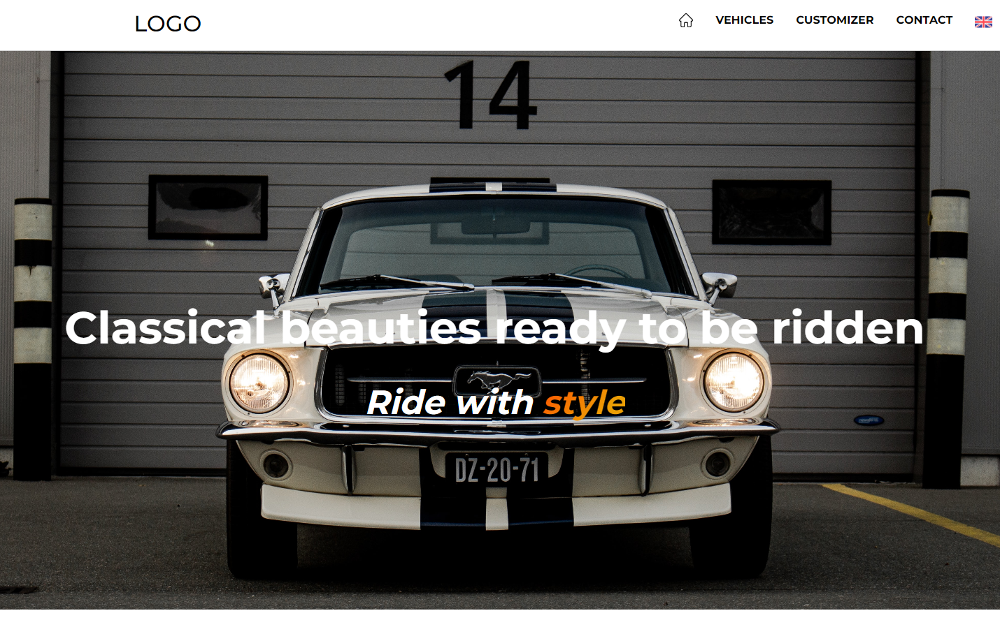
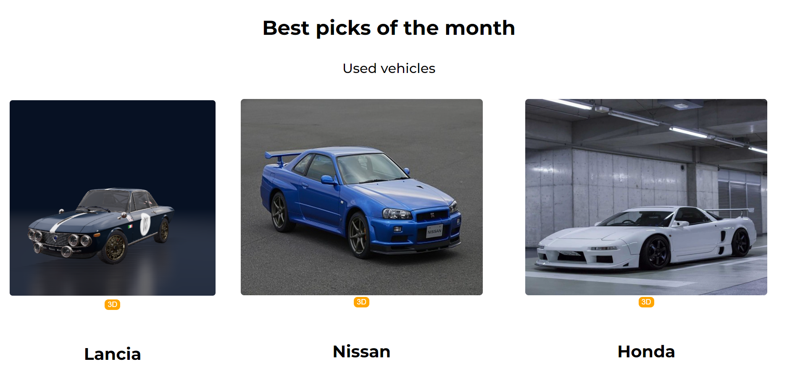
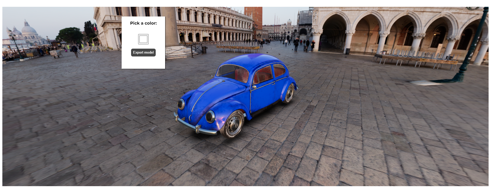

# E-commerce car shop with React Three Fiber / Three JS

An online car stand website that combines simple HTML/CSS with Three JS in order to provide a much more interesting experience for the user (not responsive though, as it is a simple POC to demonstrate the power of Three JS in e-commerce)

It has ordinary sections such as a navigation bar, hero section, cars list, footer with a special element that is a 3D model customizer, in this case a Volkswagen Beetle.

The car can be almost fully customizable with the exception of the interior elements, which is due to how the car model was made.

Model online here https://skfb.ly/6GDHE (All rights reserved to the creator)

Feel free to use and adapt this project to your needs.

